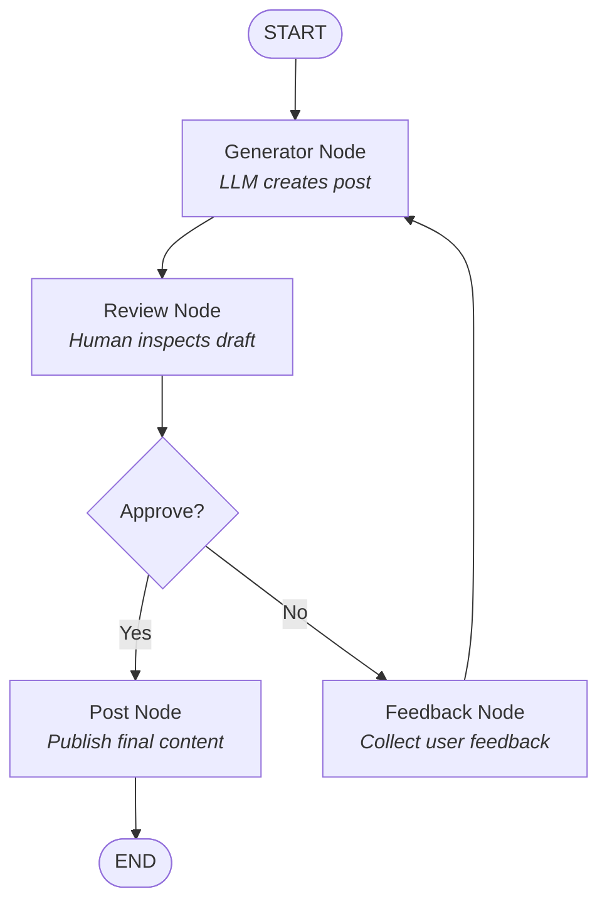

# 🤖 LinkedIn Post Agent

[](https://www.python.org/downloads/)
[](https://github.com/langchain-ai/langgraph)
[](https://streamlit.io/)
[](https://docs.pytest.org/)
[](https://groq.com/)
[](LICENSE)
[](https://github.com/astral-sh/uv)

A human-in-the-loop AI workflow that generates, reviews, iteratively improves, and publishes LinkedIn posts using **LangGraph**, **Groq**, and **Streamlit**.

The project demonstrates how to build a stateful AI workflow where an LLM generates draft content, a human reviews the result, and the workflow either approves the post or incorporates feedback for revision cycles—available both as a CLI application and an interactive Web Application.

---

## 🚀 Architecture & Workflow

The agent uses a LangGraph `StateGraph` with `MemorySaver` checkpointer persistence and conditional routing:



---

## ✨ Features

- **🌐 Interactive Streamlit Web UI**: User-friendly web interface with real-time post generation, side-by-side review, and revision controls.
- **🖥️ Command Line Interface (CLI)**: Full interactive terminal workflow.
- **⚡ High-Speed Inference**: Powered by Groq (`llama-3.1-8b-instant` / `llama-3.3-70b-versatile`).
- **💾 Checkpointer Persistence**: Integrated `MemorySaver` checkpointer supporting state saving across multi-turn sessions.
- **🧪 Automated Pytest Suite**: Full unit and integration tests covering router decisions and state graph compilation.
- **🔄 Human-in-the-Loop (HITL)**: Direct human approval or revision request at the review step.
- **📦 Modern Tooling**: Dependencies managed via `uv` for reproducible environment sync.

---

## 📁 Project Structure

```text
linkedin-post-agent/
├── src/
│   └── linkedin_post_agent/
│       ├── __init__.py      # Package initializer
│       ├── app.py           # Streamlit Web UI application
│       ├── config.py        # Environment & configuration loader
│       ├── graph.py         # LangGraph workflow definition & MemorySaver checkpointer
│       ├── nodes.py         # Graph node implementations (generate, review, feedback, post)
│       ├── router.py        # Conditional routing logic for human approval
│       └── main.py          # CLI entry point
├── tests/
│   ├── __init__.py          # Test package initializer
│   ├── test_graph.py        # Graph compilation & checkpointer tests
│   └── test_router.py       # Router logic unit tests
├── .env.example             # Template for required environment variables
├── .gitignore                # Git exclusion rules
├── pyproject.toml           # Hatch & uv project metadata
├── uv.lock                  # Lockfile for dependency reproducibility
├── README.md                # Project documentation
└── LICENSE                  # MIT License
```

---

## ⚙️ Quick Start

### 1. Prerequisites
Ensure you have **Python 3.11+** and **`uv`** installed:
```bash
curl -LsSf https://astral.sh/uv/install.sh | sh
```

### 2. Installation
Clone the repository and enter the directory:
```bash
git clone https://github.com/Bin-Naji/linkedin-post-agent.git
cd linkedin-post-agent
```

Install dependencies using `uv`:
```bash
uv sync
```

### 3. Environment Configuration
Copy `.env.example` to `.env`:
```bash
cp .env.example .env
```

Add your **Groq API Key** in `.env`:
```env
GROQ_API_KEY=gsk_your_actual_groq_api_key_here
GROQ_MODEL=llama-3.1-8b-instant
```

---

## 💻 Running the Application

### Option A: Launch Streamlit Web UI (Recommended)
```bash
uv run streamlit run src/linkedin_post_agent/app.py
```

### Option B: Run CLI Application
```bash
uv run python -m linkedin_post_agent.main
```

---

## 🧪 Running Automated Tests

Run the unit test suite using `pytest`:
```bash
uv run pytest
```

---

## 📄 License

This project is open-source and available under the [MIT License](LICENSE).